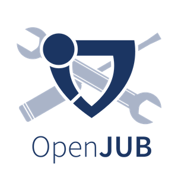

# OpenJUB API

Server providing the actual OpenJUB API

## Dependencies
- Node.JS + npm
- MongoDB

## Install

1. Install MongoDB and Node.JS

2. Run:

```
  $ git clone git@github.com/openjub/openjub-api.git
  $ cd openjub-api
  $ npm install -g grunt grunt-cli express bower
  $ npm install
  $ bower install
  $ cp _settings.json settings.json # change config if necessary
  $ ./tasks/sync # gets data from LDAP (need on campus connection)
```

## Run Server

Run the following two commands to start the server in two different folders

```
  $ mongod # start in separate tab or as daemon
  $ node server.js # server runs on default port 6969
```

## Generate Documentation

Run and start server afterwards:

```
  $ grunt docs
```

Navigate with your browser to: `http://localhost:6969/docs`

## Contributors
- Dominik Kundel <dominik.kundel@gmail.com>
- Dmitrii Cuclescin <dmitrii.cucleschin@gmail.com>
